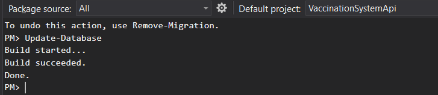
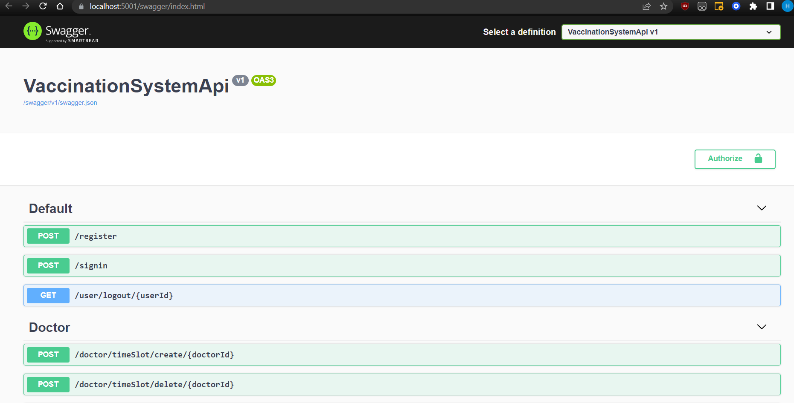
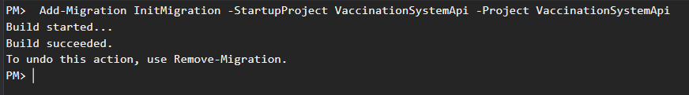

# Prerequisites
 - [DotNet 5](https://dotnet.microsoft.com/en-us/download/dotnet/5.0) (should be available with deafult VS 19 installation)
 - [SQL Server Developer Edition 2019](https://go.microsoft.com/fwlink/?linkid=866662)

 # How to Run Solution
 ## Create Database from Entity Framework Migrations
 Open Visual Studio and Run command inside `Package Manager Console`:
```ps
Update-Database
```


## Run solution
Press `F5` inside visual studio, Swagger should open automatically



# How to add new migrations
 Open Visual Studio and Run command inside `Package Manager Console`:
 ```ps
 Add-Migration <migrationName> -StartupProject VaccinationSystemApi -Project VaccinationSystemApi
 ```


And run again 
```ps
Update-Database
```